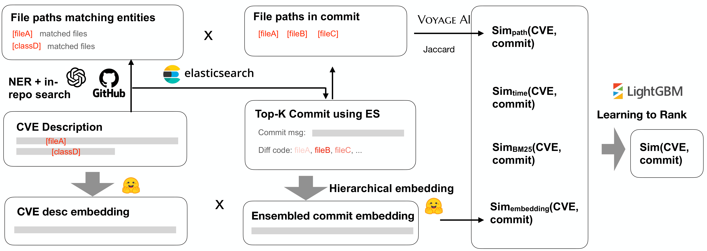
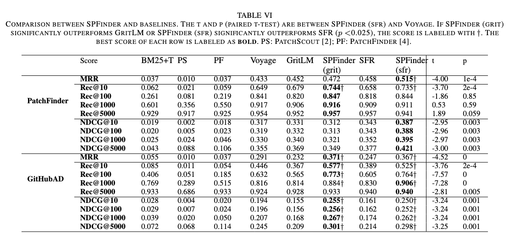

# ScalPatchFinder: A Scalable and Effective Retrieval System for Security Vulnerability Patches

This repository contains the code and data sample for our ICSE26 submission: ScalPatchFinder: A Scalable and Effective Retrieval System for Security Vulnerability Patches.

<p align="center">
    
    <br>
</p>

## Overview of ScalPatchFinder

ScalPatchFinder is a tool for retrieving the missing links to patches of CVEs. Given the text description of the CVE, ScalPatchFinder casts this problem as retrieving the commit (commit message, code diff) which most closely match the CVE description. The backbone of ScalPatchFinder is a top-ranked text embedding LLM named [GritLM-7B](https://huggingface.co/GritLM/GritLM-7B). It leverages a hierarchical embedding technique to reduce the truncation of the commit diff code. It further leverages pre-ranking using ElasticSearch and the time difference between CVE and commit, as well as NER + path search to bridge the gap by out-of-commit mentions in the CVE description. By combining these features in a learning-to-rank framework, ScalPatchFinder outperforms existing work: [PatchScout](https://yuanxzhang.github.io/paper/patchscout-ccs21.pdf), [PatchFinder](https://dl.acm.org/doi/10.1145/3650212.3680305), and [VFCFinder](https://dl.acm.org/doi/pdf/10.1145/3634737.3657007), it further outperforms the Recall@10 of VoyageAI, a commercial embedding API with state-of-the-art performance, by 13\% and 28\% on our two datasets: patchfinder and GitHubAD. 

## Pipeline of ScalPatchFinder

First, it pre-ranks all commits in a repo using BM25+Time with ElasticSearch (Section 3.2). Second, for the top-10000 commits, it computes the code embedding using our hierarchical embedding approach (Section 3.3). Third, to bridge the gap when the CVE description mentions out-of-commit entities (e.g., package names, function names), it includes a path similarity feature by searching for the file paths matching these entities, then computing their similarity with the commit paths (Section 3.4). Finally, it leverages learning-to-rank (Section 3.5) to combine all features. 


## Features used in ScalPatchFinder

Given the CVE description and one commit, ScalPatchFinder uses the following feature groups to compute the final similarity score:

| Feature Group     | Feature       |
|----------|------------|
| **Code embedding** | 1. GritLM cosine with truncated diff   |
|     | 2. Max GritLM cosine with all files in diff   |
|     | 3. GritLM cosine with mean of top-1 vectors of all files in diff   |
|     | 4. GritLM cosine with mean of top-2 vectors of all files in diff   |
| **BM25**      | 5. BM25 ElasticSearch  |
| **Time**      | 6. \#commits between CVE reserve time and commit  |
|       | 7. \#commits between CVE publish time and commit  |
| **path**  | 8. Jaccard Index between NER-paths and commit-paths  |
|   | 9. Voyage AI~\cite{voyage} cosine between NER-paths and commit-paths    |

## Instruction of reproducing ScalPatchFinder

To reproduce ScalPatchFinder, first, you need to collect the dataset following the `README.md` under data_prepare. This will creates the following directories: 

* `repo2commits_diff/`, which stores all the commit and diff data
* `csv/AD_train.csv` and `csv/AD_test.csv`, which stores the patch of each CVE

You can then reproduce ScalPatchFinder by following the steps below. Notice that we store the output of all steps under `feature/method_name/result`, including the baselines:

* `BM25+Time with ElasticSearch (Section 3.2)`: first, pre-rank all commits following the `README.md` under `es`, the output of this step is saved under `feature/bm25_time/result`

* `hierarchical embedding (Section 3.3)`: next, run code embedding following the `README.md` under `embedding`, the output of this step is saved under `feature/grit_instruct/result` (i.e., feature 1), `feature/grit_instruct_512_file/result_head1` (i.e., feature 3), `feature/grit_instruct_512_file/result_head2` (i.e., feature 4), and `feature/grit_instruct_512_file/result_head5_max` (i.e., feature 2). 

* `ner + in-repo search (Section 3.4)`: next, augment the file paths to bridge the CVE-patch gap by following the `README.md` under `ner_inrepo`, the output of this step is saved under `feature/path/result` (i.e., feature 9)

* `learning to rank (Section 3.5)`: finally, aggregate all features using lightgbm's LambdaRank algorithm by following the `README.md` under `ltr`, the output of this step is saved under `feature/ltr/result`. 

## Instruction of evaluating the ranking score of ScalPatchFinder and baselines

After the similarities are stored, you can evaluate the ranking score of each method using 

```
python recall.py model_name dataset_name suffix
```

which will reproduce the following Table 4 results with the following model_name:

* `voyage`: voyage commit level indexing
* `bm25_time`: BM25+time
* `patchscout`: PatchScout (Tan et al. 2021) 
* `patchfinder`: PatchFinder (Li et al. 2024) 
* `ltr`: ScalPatchFinder
* `grit_instruct_512_file`: grit_head2 when suffix is `_head2` 

<p align="center">
    
    <br>
</p>
