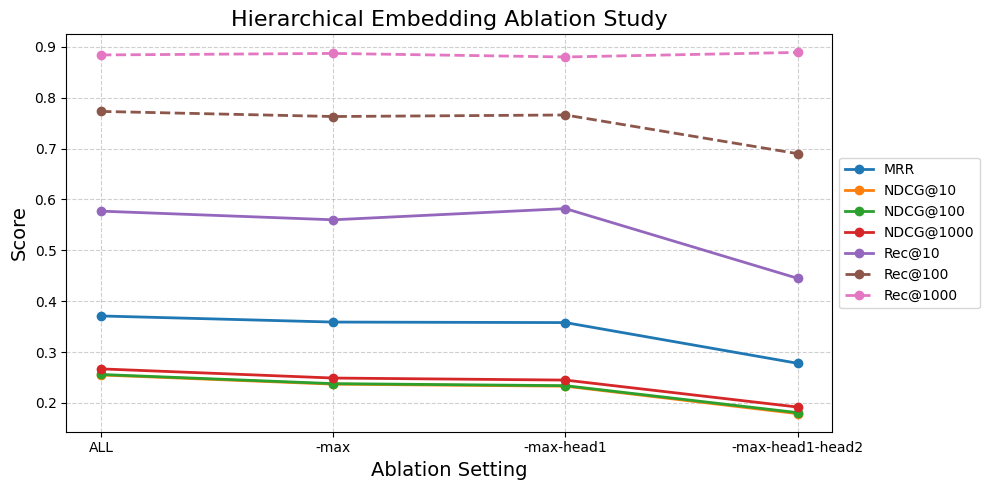
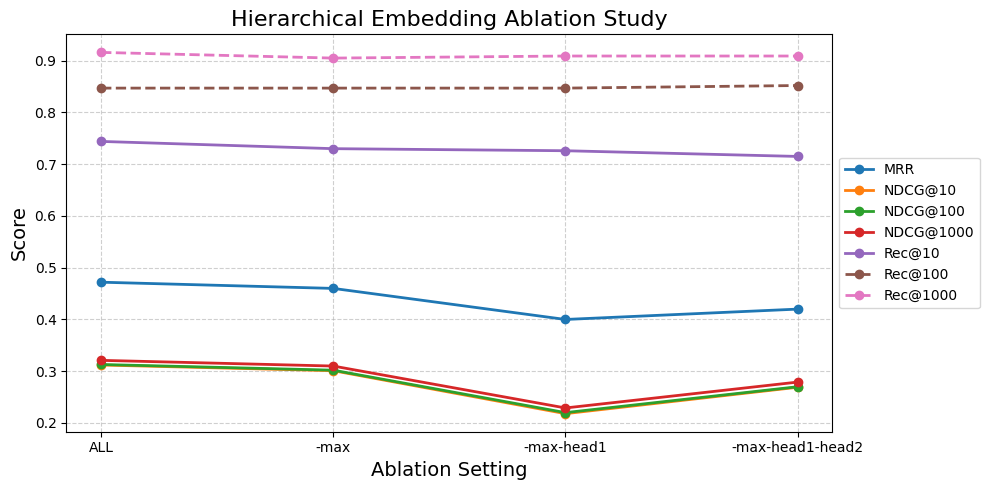

# Ablation Study on Fine-Grained Hierarchical Embedding Features

| Feature         | Description                                           |
|-----------------|-------------------------------------------------------|
| `grit`          | Commit-level similarity (baseline)                  |
| `grit_max`      | Max of file-level similarity                         |
| `grit_head1`    | Cosine with top-1 file embedding                     |
| `grit_head2`    | Cosine with mean of top-2 file embeddings           |

---
## 🔍 Observations
Based on the experimental results shown below:

- In the **GithubAD** dataset, progressively removing the hierarchical embedding features (`grit_max`, `grit_head1`, and `grit_head2`) leads to a consistent performance drop across all metrics (e.g., MRR, NDCG, Recall). The most significant drop occurs when `grit_head2` is removed, highlighting its importance to the model’s performance on this dataset.

- For the **PatchFinder** dataset, the role of `grit_head2` appears more nuanced. On one hand, **removing `grit_head2` from the full model leads to a notable performance drop**, suggesting it carries unique and beneficial information. On the other hand, **retaining only `grit_head2` (i.e., `-max-head1`) results in worse performance than removing all hierarchical features** (`-max-head1-head2`, i.e., only using base `grit`). This counterintuitive result indicates that **`grit_head2` alone is insufficient and may require complementary features like `grit_max` or `grit_head1` to be effective**. Additionally, the **relatively strong performance of the base-only setup (`only grit`)** implies that hierarchical features may interfere with each other when not combined appropriately. These patterns reflect **potential feature redundancy and interaction effects** among the hierarchical embedding variants, which arise from shared commit-level representations.

---

### 🔹 GithubAD

### 🔹 PatchFinder

###  Below are tables of all results.

## 🗂 GithubAD Dataset

| Setting         | grit_max | grit_head1 | grit_head2 | MRR   | NDCG@10 | NDCG@100 | NDCG@1000 | NDCG@5000 | R@10  | R@100 | R@1000 | R@5000 |
|-----------------|----------|------------|------------|-------|---------|----------|-----------|-----------|-------|-------|--------|--------|
| Full            | ✅       | ✅         | ✅         | 0.371 | 0.255   | 0.256    | 0.267     | 0.301     | 0.577 | 0.773 | 0.884  | 0.933  |
| -grit_head1     | ✅       | ❌         | ✅         | 0.370 | 0.248   | 0.249    | 0.260     | 0.295     | 0.575 | 0.774 | 0.883  | 0.932  |
| -grit_head2     | ✅       | ✅         | ❌         | 0.357 | 0.238   | 0.240    | 0.250     | 0.286     | 0.565 | 0.754 | 0.881  | 0.931  |
| -grit_max       | ❌       | ✅         | ✅         | 0.359 | 0.237   | 0.238    | 0.249     | 0.284     | 0.560 | 0.763 | 0.887  | 0.942  |
| only grit       | ❌       | ❌         | ❌         | 0.278 | 0.179   | 0.181    | 0.192     | 0.231     | 0.445 | 0.690 | 0.889  | 0.943  |
| only grit_head1 | ❌       | ✅         | ❌         | 0.305 | 0.194   | 0.196    | 0.207     | 0.245     | 0.503 | 0.747 | 0.902  | 0.943  |
| only grit_head2 | ❌       | ❌         | ✅         | 0.339 | 0.220   | 0.221    | 0.232     | 0.268     | 0.551 | 0.761 | 0.909  | 0.943  |
| only grit_max   | ✅       | ❌         | ❌         | 0.345 | 0.230   | 0.231    | 0.242     | 0.278     | 0.555 | 0.761 | 0.902  | 0.943  |

---

## 🗂 PatchFinder Dataset

| Setting         | grit_max | grit_head1 | grit_head2 | MRR   | NDCG@10 | NDCG@100 | NDCG@1000 | NDCG@5000 | R@10  | R@100 | R@1000 | R@5000 |
|-----------------|----------|------------|------------|-------|---------|----------|-----------|-----------|-------|-------|--------|--------|
| Full            | ✅       | ✅         | ✅         | 0.472 | 0.312   | 0.313    | 0.321     | 0.349     | 0.744 | 0.847 | 0.916  | 0.957  |
| -grit_head1     | ✅       | ❌         | ✅         | 0.467 | 0.304   | 0.305    | 0.313     | 0.341     | 0.746 | 0.852 | 0.908  | 0.951  |
| -grit_head2     | ✅       | ✅         | ❌         | 0.448 | 0.288   | 0.289    | 0.298     | 0.326     | 0.744 | 0.854 | 0.908  | 0.957  |
| -grit_max       | ❌       | ✅         | ✅         | 0.460 | 0.301   | 0.302    | 0.310     | 0.338     | 0.730 | 0.847 | 0.905  | 0.954  |
| only grit       | ❌       | ❌         | ❌         | 0.420 | 0.269   | 0.270    | 0.279     | 0.308     | 0.715 | 0.852 | 0.909  | 0.957  |
| only grit_head1 | ❌       | ✅         | ❌         | 0.334 | 0.163   | 0.164    | 0.174     | 0.207     | 0.684 | 0.844 | 0.919  | 0.959  |
| only grit_head2 | ❌       | ❌         | ✅         | 0.356 | 0.170   | 0.172    | 0.181     | 0.214     | 0.714 | 0.854 | 0.919  | 0.956  |
| only grit_max   | ✅       | ❌         | ❌         | 0.372 | 0.191   | 0.193    | 0.202     | 0.234     | 0.714 | 0.844 | 0.919  | 0.960  |

